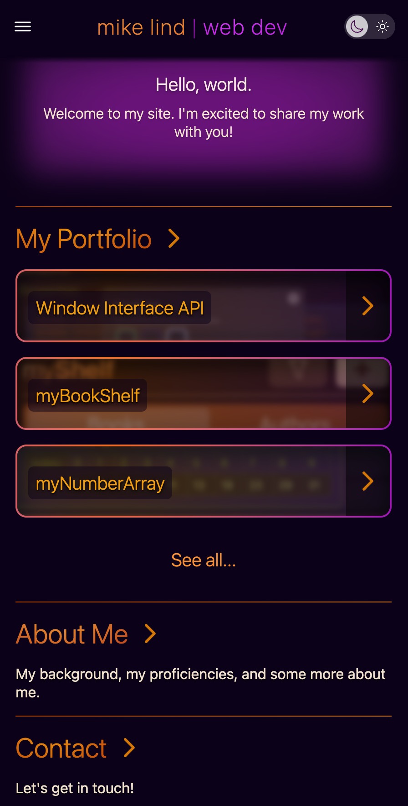
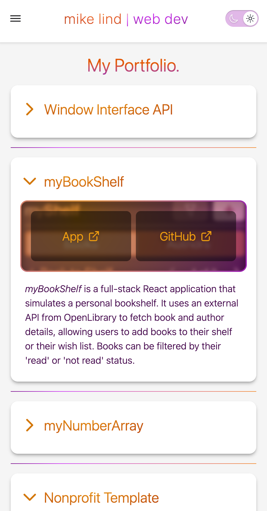

# My Portfolio

## Description

This is the code for my personal portfolio website. It links to several apps I've created and lists some more information about myself. This site includes responsive design for mobile + desktop, and dark + light modes.

## Technologies

This project was created using TypeScript, React, React-Router, Vite, Tailwind CSS, and Motion.

## Screenshots

**Home Page - Dark Mode**

**Portfolio Page - Light Mode**

## License

This repository uses an [MIT License ↗️](./LICENSE.txt).
